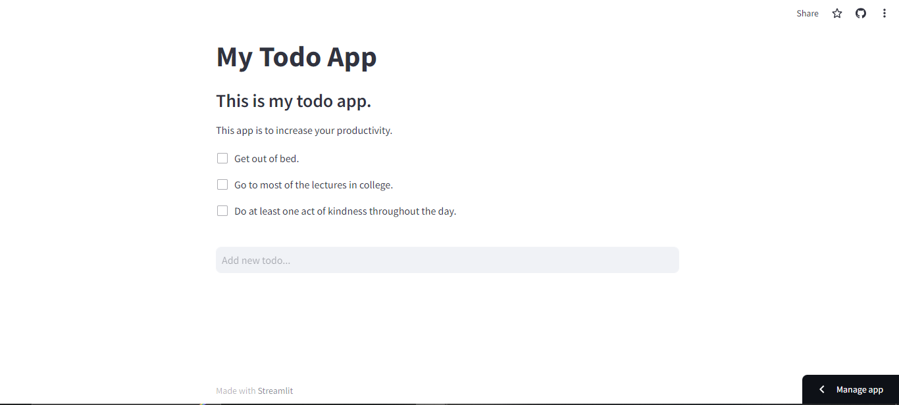

# To Do App Using Python
Create To Do App Using Python.

## Table Content
- About The Project
- Screenshot
- Technologies

## About This Project
This web app are builded using Python to increase productivity in daily life. This website also using streamlit to deploy web app in cloud.

## Screenshot
Here is some example of web app sneakpeek, or you can easily access it from  [this link](https://app1-to-do.streamlit.app/).
 

## Techonologies
- Python 
- Streamlit
